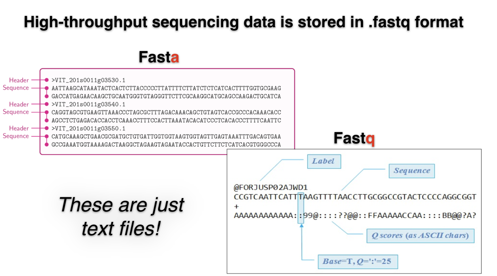

## FASTQ Format
**FASTQ format** is typically used for raw sequence reads from high-throughput sequencing technologies like Illumina. 

It includes raw sequence reads and per-base quality scores.



##### **FASTQ sequences files typically:**

- are compressed (e.g., with ```gzip```). The file extension is typically ```.fastq.gz``` or ```.fq.gz```
- are very large (e.g., 10s of GBs or more) because they contain raw sequence reads. To obtain a new genome assembly, we want to sequence that individual at least 30 times. Similarly, to estimate gene expression amplitudes, we may want 30,000,000 pairs of 150-nucleotide reads per sample. In both cases, there is a lot of redundancy that downstream processing will remove.
- FASTQ files from an **Illumina** (or other **short-read sequencer**):
  - come in **pairs**, where each pair is a forward and reverse read from the same initial 350 nucleotide DNA fragment.
  - The first read of each fragment is stored in one file (e.g., ```mysample_1.fastq.gz```), and the read from the other end of the fragment is stored in the adjacent file (e.g., ```mysample_2.fastq.gz```).
  - These files are often called “read 1” and “read 2” files, or “R1” and “R2” files.
- FASTQ files from **PacBio or Oxford Nanopore long-read single-molecule sequencer**s:
  - contain only **one read per fragment**, and thus only one file is produced per sample.


