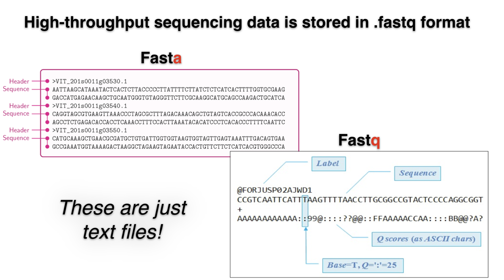

## FASTQ Format
**FASTQ format** is typically used for raw sequence reads from high-throughput sequencing technologies like Illumina. 

It includes raw sequence reads and per-base quality scores.

##### **Example of a FASTQ file with one nucleotide read:**
```
@NS500784:901:HWH5GBGXL:1:11104:2976:10099 1:N:0:2
TCCCAAAGTATAATCAAAATACGATGTGAATGAATATA
+
AA6A/E6//6A/AAE/EEEE/<EE///</E//EEAEEE
```


